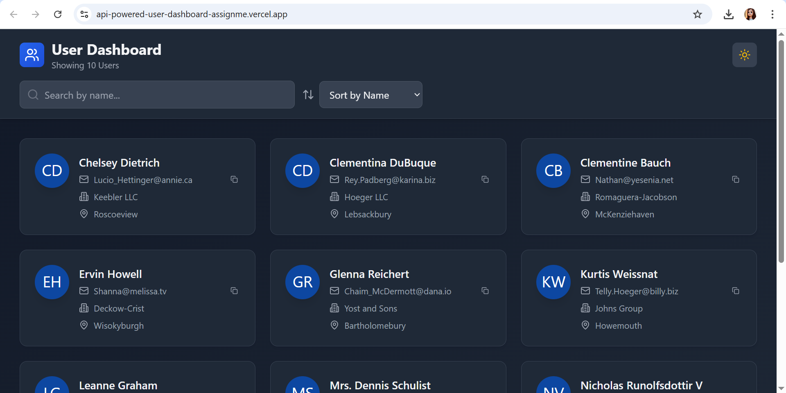
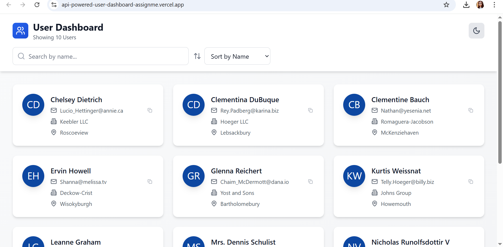

<div align="center">

# 🚀 User Dashboard



<p align="center">
  <strong>A blazing-fast, beautifully designed User Dashboard built with React + TypeScript + Vite</strong><br/>
  <sub>Search • Sort • Dark Mode • Real-time filtering • Smooth animations</sub>
</p>

<p align="center">
  
  
  
  
</p>

<p align="center">
  
  
  
  
</p>

</div>

---

## 🌓 Light & Dark Mode

<table>
  <tr>
    <td align="center" width="50%">
      
      <br/><strong>🌑 Dark Mode</strong>
    </td>
    <td align="center" width="50%">
      
      <br/><strong>☀️ Light Mode</strong>
    </td>
  </tr>
</table>

---

## ✨ Features at a Glance

| Feature | Description |
|--------|-------------|
| 🔍 **Real-time Search** | Instantly filter users by name as you type |
| ↕️ **Smart Sorting** | Sort alphabetically by name or company |
| 🌙 **Dark / Light Mode** | Persistent theme toggle with system preference detection |
| 📋 **Copy Email** | One-click email copy with visual feedback |
| 🖼️ **Avatar Generation** | Auto-generated initials avatars for every user |
| 🪟 **Detail Modal** | Click any card to open a full-detail modal with animations |
| ⚡ **Skeleton Loading** | Shimmer loading placeholders during data fetch |
| ❌ **Error Handling** | Graceful error states with retry support |
| 📱 **Fully Responsive** | 1 / 2 / 3 column grid adapts to any screen size |
| 🎨 **Smooth Animations** | Scale, hover, slide-up, and fade transitions throughout |

---

## 🏗️ Architecture Overview

```
┌─────────────────────────────────────────────────────────────────┐
│                        User Dashboard App                        │
│                                                                   │
│  ┌───────────────────────────────────────────────────────────┐   │
│  │                      App.tsx (Root)                        │   │
│  │                                                             │   │
│  │  State: users[] | loading | error | searchQuery | sortBy  │   │
│  │                    selectedUser | isDark                   │   │
│  └─────────────────────────┬─────────────────────────────────┘   │
│                             │                                     │
│         ┌───────────────────┼───────────────────┐                │
│         ▼                   ▼                   ▼                │
│  ┌─────────────┐   ┌──────────────────┐  ┌───────────────┐      │
│  │   Header    │   │      Main        │  │  UserModal    │      │
│  │             │   │                  │  │  (Overlay)    │      │
│  │ SearchBar   │   │ LoadingSpinner   │  │               │      │
│  │ SortControls│   │ ErrorMessage     │  │ Full Details  │      │
│  │ ThemeToggle │   │ UserCard × N     │  │ Address       │      │
│  └─────────────┘   └──────────────────┘  │ Company Info  │      │
│                                           └───────────────┘      │
└─────────────────────────────────────────────────────────────────┘
```

---

## 🔄 Application Flow

```
                         ┌──────────────────┐
                         │   App Launches    │
                         └────────┬─────────┘
                                  │
                    ┌─────────────▼─────────────┐
                    │  Read localStorage theme   │
                    │  Apply dark/light class    │
                    └─────────────┬─────────────┘
                                  │
                    ┌─────────────▼─────────────┐
                    │  Fetch users from API      │
                    │  jsonplaceholder.typicode  │
                    └──────┬──────────┬──────────┘
                           │          │
                     ✅ OK │          │ ❌ Error
                           │          │
              ┌────────────▼──┐  ┌────▼──────────────┐
              │  setUsers([]) │  │  setError(message) │
              └────────┬──────┘  └────────┬───────────┘
                       │                  │
              ┌────────▼──────┐  ┌────────▼───────────┐
              │ Display Cards │  │  Show Error + Retry │
              └────────┬──────┘  └─────────────────────┘
                       │
          ┌────────────┼─────────────┐
          │            │             │
   ┌──────▼──────┐  ┌──▼────┐  ┌────▼────────┐
   │ User types  │  │ User  │  │  User clicks │
   │ in search   │  │ sorts │  │   a card    │
   └──────┬──────┘  └──┬────┘  └────┬────────┘
          │            │             │
   ┌──────▼──────┐  ┌──▼────────┐  ┌▼──────────────┐
   │  Filter by  │  │ Sort A→Z  │  │  Open Modal   │
   │  name query │  │ by name / │  │  with full    │
   │  (useMemo)  │  │ company   │  │  user details │
   └─────────────┘  └───────────┘  └───────────────┘
```

---

## 🧩 Component Hierarchy

```
App
├── <header>
│   ├── UsersIcon + Title
│   ├── ThemeToggle          → toggles isDark state
│   ├── SearchBar            → controlled input → setSearchQuery
│   └── SortControls         → select dropdown → setSortBy
│
├── <main>
│   ├── LoadingSpinner        (conditional: loading === true)
│   │   └── 6× Skeleton Cards
│   │
│   ├── ErrorMessage          (conditional: error !== null)
│   │   ├── AlertCircle icon
│   │   └── Retry Button → fetchUsers()
│   │
│   ├── EmptyState            (conditional: results.length === 0)
│   │   └── Clear Search Button
│   │
│   └── UserCard × N          (conditional: results.length > 0)
│       ├── Avatar Image
│       ├── Name
│       ├── Email + CopyButton
│       ├── Company
│       └── City
│
└── UserModal                 (conditional: selectedUser !== null)
    ├── Avatar (large)
    ├── Name + Username
    ├── Email + Phone + Website + Company (grid)
    ├── Address Block
    └── Company Catchphrase + BS
```

---

## 🗂️ Project Structure

```
user-dashboard/
│
├── 📄 index.html                  # Entry HTML
├── 📦 package.json                # Dependencies & scripts
├── ⚙️  vite.config.ts              # Vite bundler config
├── 🎨 tailwind.config.js          # Tailwind + dark mode setup
├── 🔧 tsconfig.app.json           # TypeScript config
│
└── src/
    ├── 🚀 main.tsx                # React DOM entry point
    ├── 🏠 App.tsx                 # Root component + all state
    ├── 🎨 index.css               # Tailwind + custom animations
    │
    ├── types/
    │   └── 📐 user.ts             # User / Address / Company interfaces
    │
    └── components/
        ├── 🃏 UserCard.tsx        # Individual user card
        ├── 🪟 UserModal.tsx       # Detail overlay modal
        ├── 🔍 SearchBar.tsx       # Controlled search input
        ├── ↕️  SortControls.tsx    # Sort dropdown
        ├── 🌙 ThemeToggle.tsx     # Dark/light toggle button
        ├── ⏳ LoadingSpinner.tsx  # Skeleton loading grid
        └── ❌ ErrorMessage.tsx    # Error state with retry
```

---

## 🔀 Data Flow Diagram

```
  JSONPlaceholder API
  /users endpoint
         │
         │  fetch()
         ▼
  ┌─────────────┐     error     ┌──────────────────┐
  │  fetchUsers │ ─────────────▶│  ErrorMessage    │
  │  (async)    │               │  + Retry Button  │
  └──────┬──────┘               └──────────────────┘
         │ success
         ▼
  ┌─────────────────────────────────────────────────────┐
  │                  users[ ] (React State)              │
  └─────────────────────────┬───────────────────────────┘
                             │
              ┌──────────────┼──────────────┐
              │              │              │
         searchQuery       sortBy      (unchanged)
              │              │
              └──────┬───────┘
                     │ useMemo
                     ▼
  ┌──────────────────────────────────────────────────────┐
  │           filteredAndSortedUsers[ ]                   │
  │   filter(name includes searchQuery)                   │
  │   .sort(by name | company)                           │
  └──────────────────────────┬───────────────────────────┘
                              │
                  ┌───────────▼───────────┐
                  │  UserCard × N Render  │
                  └───────────────────────┘
```

---

## 🎨 Theme System

```
  User clicks ThemeToggle
         │
         ▼
  ┌──────────────────────┐
  │  setIsDark(!isDark)  │
  └──────────┬───────────┘
             │
    ┌────────▼─────────┐
    │  useEffect fires  │
    └────────┬──────────┘
             │
     ┌───────┴────────┐
     │                │
  isDark?          !isDark?
     │                │
  ┌──▼──────────┐  ┌──▼──────────────┐
  │ Add 'dark'  │  │ Remove 'dark'   │
  │ class to    │  │ class from      │
  │ <html>      │  │ <html>          │
  │             │  │                 │
  │ localStorage│  │ localStorage    │
  │ = 'dark'    │  │ = 'light'       │
  └─────────────┘  └─────────────────┘
         │
         ▼
  All Tailwind dark: variants activate
  Smooth CSS transitions apply
```

---

## ⚡ Tech Stack

<table>
  <tr>
    <th>Layer</th>
    <th>Technology</th>
    <th>Purpose</th>
  </tr>
  <tr>
    <td>⚛️ UI Framework</td>
    <td>React 18 + TypeScript</td>
    <td>Component model, hooks, type safety</td>
  </tr>
  <tr>
    <td>⚡ Build Tool</td>
    <td>Vite 5</td>
    <td>HMR, fast builds, ESM bundling</td>
  </tr>
  <tr>
    <td>🎨 Styling</td>
    <td>Tailwind CSS 3.4</td>
    <td>Utility-first, dark mode, responsive</td>
  </tr>
  <tr>
    <td>🔣 Icons</td>
    <td>Lucide React</td>
    <td>Consistent, tree-shakeable SVG icons</td>
  </tr>
  <tr>
    <td>🌐 Data Source</td>
    <td>JSONPlaceholder API</td>
    <td>Free REST API with mock user data</td>
  </tr>
  <tr>
    <td>🧹 Linting</td>
    <td>ESLint + TypeScript-ESLint</td>
    <td>Code quality & consistency</td>
  </tr>
</table>

---

## 🚀 Getting Started

### Prerequisites

```
Node.js >= 16
npm or yarn
```

### Installation & Development

```bash
# 1. Clone the repository
git clone <repository-url>
cd user-dashboard

# 2. Install dependencies
npm install

# 3. Start development server
npm run dev

# 4. Open in browser
# → http://localhost:5173
```

### Production Build

```bash
# Build for production
npm run build

# Preview the production build
npm run preview

# Type-check without emitting
npm run typecheck

# Lint codebase
npm run lint
```

---

## 📱 Responsive Breakpoints

```
  Mobile (< 768px)          Tablet (768px–1024px)      Desktop (> 1024px)
  ┌────────────────┐         ┌──────────┬──────────┐    ┌──────┬──────┬──────┐
  │                │         │          │          │    │      │      │      │
  │  [User Card]   │         │  [Card]  │  [Card]  │    │[Card]│[Card]│[Card]│
  │                │         │          │          │    │      │      │      │
  ├────────────────┤         ├──────────┼──────────┤    ├──────┼──────┼──────┤
  │                │         │          │          │    │      │      │      │
  │  [User Card]   │         │  [Card]  │  [Card]  │    │[Card]│[Card]│[Card]│
  │                │         │          │          │    │      │      │      │
  └────────────────┘         └──────────┴──────────┘    └──────┴──────┴──────┘
   grid-cols-1                 grid-cols-2                grid-cols-3
```

---

## 🔌 API Reference

**Endpoint:** `GET https://jsonplaceholder.typicode.com/users`

```jsonc
// Example User Object
{
  "id": 1,
  "name": "Leanne Graham",
  "username": "Bret",
  "email": "Sincere@april.biz",
  "address": {
    "street": "Kulas Light",
    "suite": "Apt. 556",
    "city": "Gwenborough",
    "zipcode": "92998-3874"
  },
  "phone": "1-770-736-0988 x56442",
  "website": "hildegard.org",
  "company": {
    "name": "Romaguera-Crona",
    "catchPhrase": "Multi-layered client-server neural-net",
    "bs": "harness real-time e-markets"
  }
}
```

---

## 🧠 State Management

```
App Component State
┌────────────────────────────────────────────────────────────┐
│                                                             │
│  users:          User[]     ← fetched from API             │
│  loading:        boolean    ← true during fetch            │
│  error:          string?    ← null on success              │
│  searchQuery:    string     ← controlled by SearchBar      │
│  sortBy:         name|co.   ← controlled by SortControls   │
│  selectedUser:   User?      ← null = no modal open         │
│  isDark:         boolean    ← persisted in localStorage    │
│                                                             │
│  filteredAndSortedUsers: User[]  ← derived via useMemo     │
│  (recomputes only when users / searchQuery / sortBy change)│
│                                                             │
└────────────────────────────────────────────────────────────┘
```

---

## 🤝 Contributing

1. Fork the repository
2. Create your feature branch: `git checkout -b feature/amazing-feature`
3. Commit your changes: `git commit -m 'Add amazing feature'`
4. Push to the branch: `git push origin feature/amazing-feature`
5. Open a Pull Request

---

## 📄 License

This project is licensed under the **MIT License** — see the [LICENSE](LICENSE) file for details.

---

<div align="center">

Built with ❤️ using **React**, **TypeScript**, and **Tailwind CSS**

⭐ Star this repo if you found it useful!

</div>
